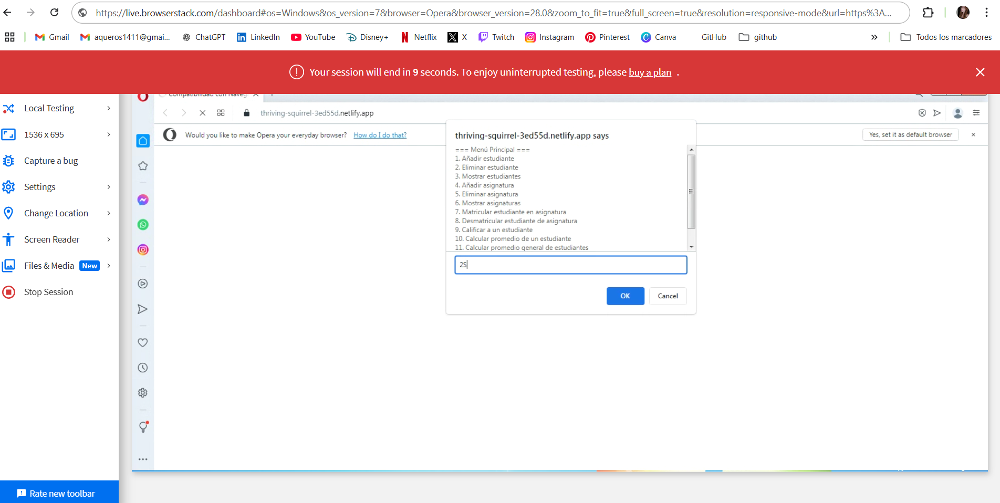
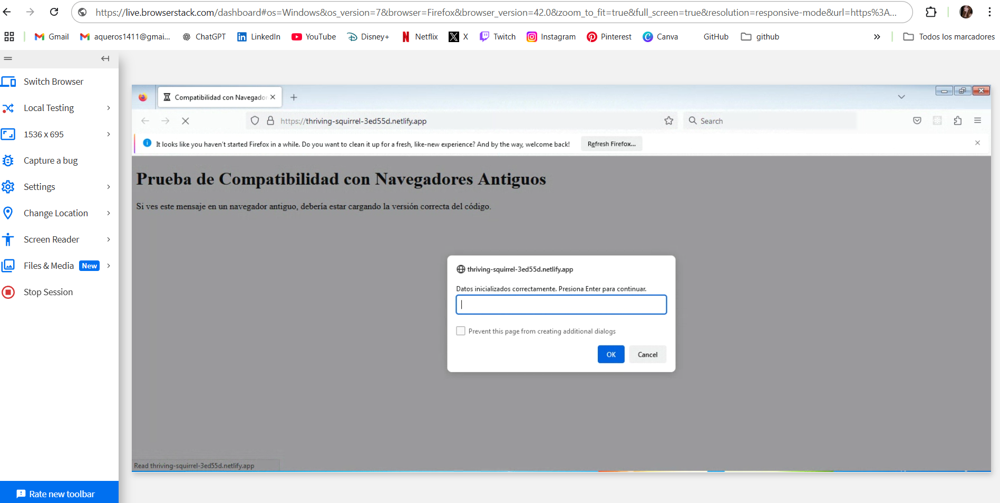

# Polyfilling y Transpilación en SGAEA

## Descripción del Proyecto

Este proyecto tiene como objetivo implementar, configurar y verificar el uso de Node.js, Webpack y Babel para realizar polyfilling y transpilación del código del Sistema de Gestión Académica de Estudiantes y Asignaturas (SGAEA). Con esta configuración, se garantiza que el código pueda ejecutarse tanto en navegadores modernos como en versiones antiguas.

## Estructura del Proyecto

```
/Task4.5-Compatibility_with_older_browsers
│
├── /js
│   ├── Asignatura.js
│   ├── Direccion.js
│   ├── Estudiante.js
│   ├── ListaAsignaturas.js
│   ├── ListaEstudiantes.js
│   ├── Persona.js
│   └── index.js
├── .babelrc
├── .gitignore
├── package-lock.json
├── package.json
├── webpack.common.js
├── webpack.legacy.js
├── webpack.modern.js
└── index.html
```

## Configuración del Entorno

### 1. Instalación de Node.js y Creación del Proyecto

Descargar e instalar [Node.js](https://nodejs.org/). Una vez instalado, inicializar el proyecto ejecutando:

```sh
npm init -y
```

### 2. Instalación de Dependencias

Se instalan los paquetes necesarios para la transpilación y compatibilidad:

```sh
npm install --save-dev webpack webpack-cli webpack-merge @babel/core @babel/preset-env babel-loader core-js regenerator-runtime copy-webpack-plugin cross-env html-webpack-plugin
```

**Explicación de los paquetes:**

- `webpack`: Genera bundles de JavaScript.
- `webpack-cli`: Permite ejecutar Webpack desde la terminal.
- `webpack-merge`: Facilita la combinación de configuraciones de Webpack.
- `@babel/core` y `@babel/preset-env`: Configuran Babel para transpilación.
- `babel-loader`: Integra Babel con Webpack.
- `core-js`: Aporta polyfills.
- `regenerator-runtime`: Provee polyfills para funciones asíncronas.
- `copy-webpack-plugin`: Copia archivos estáticos.
- `html-webpack-plugin`: Genera archivos HTML.

## Configuración de Webpack

### `webpack.comun.js`

```javascript
export default {
  entry: './js/main.js',
  output: {
    path: path.resolve(process.cwd(), 'compilado', process.env.modo),
  },
  mode: process.env.modo,
  plugins: [
    new CopyWebpackPlugin({
        patterns: [{ from: './index.html', to: '.' }],
    }),
  ],
};
```

### `webpack.moderno.js`

```javascript
import { merge } from 'webpack-merge';  
import comun from './webpack.comun.js';

export default merge(comun, {
    output: { filename: 'bundle.moderno.js' },
});
```

### `webpack.antiguo.js`

```javascript
import { merge } from 'webpack-merge';
import common from './webpack.comun.js';

export default merge(common, {
    output: { filename: 'bundle.antiguo.js' },
    module: {
        rules: [
            { test: /\.js$/, exclude: /node_modules/, use: { loader: 'babel-loader' } }
        ],
    },
});
```

## Configuración de Babel

Se crea el archivo `babel.config.js` con la siguiente configuración:

```javascript
export default {
    presets: [
      [
        '@babel/preset-env',
        {
          targets: '> 0.25%, not dead',
          useBuiltIns: 'usage',        
          corejs: 3                    
        }
      ]
    ]
};
```

## Configuración del HTML

Para asegurar la compatibilidad, el `index.html` debe incluir:

```html
<script defer type="module" src="bundle.moderno.js"></script>
<script defer src="bundle.antiguo.js"></script>
```

## Creación de Scripts en `package.json`

```json
"scripts": {
    "antiguo": "cross-env-shell webpack --config webpack.antiguo.js --mode $modo",
    "moderno": "cross-env-shell webpack --config webpack.moderno.js --mode $modo",
    "des": "cross-env-shell modo=development run-s antiguo moderno",
    "prod": "cross-env-shell modo=production run-s antiguo moderno",
    "clean:comp": "rimraf compilado",
    "start": "run-s clean:comp des prod"
}
```

## Generación de Bundles y Pruebas de Compatibilidad

Para generar los bundles:

```sh
npm run start
```

Esto creará la carpeta `compilado` con dos subcarpetas:

- `development` (modo desarrollo)
- `production` (modo producción)

Para verificar la compatibilidad en navegadores antiguos, se utilizó **BrowserStack** tras desplegar el proyecto en **Netlify**. Pasos:

1. Crear una cuenta en [Netlify](https://www.netlify.com/).
2. Subir el repositorio.
3. Configurar el directorio de publicación (`compilado/production`).
4. Desplegar el sitio web.

### Pruebas en Navegadores Antiguos

Se probaron los siguientes navegadores en **BrowserStack**:

#### **Opera 28**



#### **Mozilla Firefox 42**



## Conclusiones

- El sistema es compatible con navegadores antiguos y modernos.
- La configuración de Webpack y Babel permite la correcta transpilación.
- Algunos navegadores antiguos muestran problemas menores en estilos CSS.

## Autor

Ana Quero de la Rosa

